# Sistema de Gestión de Gimnasio - Flutter + Node.js

Una aplicación completa para la gestión de gimnasios, desarrollada con Flutter (frontend) y Node.js + Express (backend). Disponible para Web y Android.

## Características

### Funcionalidades Completas
- ✅ **Autenticación JWT** - Login, registro, recuperación de contraseña y logout
- ✅ **Dashboard dinámico** - Métricas en tiempo real, gráficas de ingresos y distribución de planes
- ✅ **Gestión de socios** - CRUD completo con búsqueda, filtros y exportación
- ✅ **Gestión de planes** - Crear y administrar membresías con características personalizadas
- ✅ **Gestión de suscripciones** - Asignación automática de fechas y control de estados
- ✅ **Control de pagos** - Registro de pagos, recibos y múltiples métodos de pago
- ✅ **Control de asistencia** - Check-in/Check-out con validación de suscripciones activas
- ✅ **Reportes y estadísticas** - Análisis de datos con exportación CSV y PDF
- ✅ **Perfil de usuario** - Información dinámica del usuario autenticado

## Tecnologías Utilizadas

### Frontend (Flutter)
- **Flutter 3.24+** - Framework de desarrollo
- **Dart 3+** - Lenguaje de programación
- **Material 3** - Sistema de diseño
- **go_router** - Navegación declarativa
- **http** - Peticiones HTTP al backend
- **shared_preferences** - Almacenamiento local persistente
- **flutter_dotenv** - Variables de entorno
- **flex_color_scheme** - Temas personalizables
- **Google Fonts** - Tipografías
- **fl_chart** - Gráficas y visualizaciones
- **printing** - Generación de recibos

### Backend (Node.js)
- **Node.js 20+** - Runtime de JavaScript
- **Express 5** - Framework web
- **SQLite** - Base de datos
- **JWT** - Autenticación
- **better-sqlite3** - Driver de base de datos
- **bcryptjs** - Encriptación de contraseñas

## Requisitos

### Para Web
- Flutter 3.24 o superior
- Dart 3.0 o superior
- Navegador web moderno (Chrome, Firefox, Safari, Edge)

### Para Android
- Flutter 3.24 o superior
- Dart 3.0 o superior
- Android SDK (API nivel 21 o superior)
- Android Studio o Android SDK Command-line Tools
- Un dispositivo Android o emulador conectado

## Instalación y Ejecución

### 1. Configurar el Backend

```bash
# Navegar al directorio del backend
cd ../GymRestBack

# Instalar dependencias
npm install

# Configurar base de datos
npm run migrate
npm run seed

# Iniciar servidor
npm run dev
```

El backend estará corriendo en `http://localhost:3000`

### 2. Configurar el Frontend

```bash
# Navegar al directorio del frontend
cd GymApp

# Instalar dependencias
flutter pub get

# El archivo .env ya está configurado con:
# API_BASE_URL=http://localhost:3000
```

### 3. Ejecutar la Aplicación

**Para Web:**
```bash
flutter run -d chrome
```

**Para Android:**
```bash
# Listar dispositivos disponibles
flutter devices

# Ejecutar en dispositivo/emulador Android
flutter run -d android
```

### 4. Credenciales de Acceso

- **Email:** `admin@gymrest.test`
- **Password:** `admin123`

4. **Compilar para producción**

   **Para Web:**
   ```bash
   flutter build web
   ```
   
   **Para Android:**
   ```bash
   # APK de depuración
   flutter build apk
   
   # APK de lanzamiento (requiere configuración de firma)
   flutter build apk --release
   
   # App Bundle para Google Play Store
   flutter build appbundle --release
   ```
   
   El APK se encontrará en: `build/app/outputs/flutter-apk/app-release.apk`

## Estructura del Proyecto

```
lib/
├── app/
│   ├── app.dart              # Configuración principal de la app
│   └── router.dart           # Configuración de rutas
├── core/
│   ├── config/
│   │   └── api_config.dart   # Configuración de API
│   ├── models/               # Modelos de datos
│   │   ├── api_response.dart
│   │   ├── user.dart
│   │   ├── member.dart
│   │   ├── plan.dart
│   │   ├── subscription.dart
│   │   ├── payment.dart
│   │   └── attendance.dart
│   ├── services/             # Servicios HTTP
│   │   ├── http_service.dart
│   │   ├── storage_service.dart
│   │   ├── auth_service.dart
│   │   ├── members_service.dart
│   │   ├── plans_service.dart
│   │   ├── subscriptions_service.dart
│   │   ├── payments_service.dart
│   │   ├── attendance_service.dart
│   │   └── reports_service.dart
│   ├── utils/                # Utilidades
│   └── widgets/              # Widgets reutilizables
├── features/                 # Páginas (todas integradas)
│   ├── login/               # ✅ Login con backend
│   ├── dashboard/           # ✅ Dashboard con datos reales
│   ├── members/             # ✅ CRUD de socios
│   ├── plans/               # ✅ CRUD de planes
│   ├── subscriptions/       # ✅ CRUD de suscripciones
│   ├── payments/            # ✅ CRUD de pagos
│   ├── attendance/          # ✅ Check-in/out
│   ├── reports/             # ✅ Reportes
│   └── settings/            # Configuración
├── .env                     # Variables de entorno
└── main.dart               # Punto de entrada
```

## Características de la Página de Login

- **Diseño moderno** con gradientes y Material 3
- **Validación de formularios** en tiempo real
- **Campos de entrada** con iconos y placeholders
- **Botón de mostrar/ocultar contraseña**
- **Estados de carga** con indicadores visuales
- **Mensajes informativos** para funcionalidades en desarrollo
- **Modo demo** con instrucciones claras
- **Responsive design** que se adapta a diferentes pantallas

## Arquitectura del Proyecto

```mermaid
graph TB
    subgraph "Capa de Presentación - UI"
        MAIN[main.dart<br/>Entry Point]
        APP[app.dart<br/>MaterialApp.router]
        ROUTER[router.dart<br/>go_router]
        
        subgraph "Features - Páginas"
            LOGIN[login_page.dart<br/>Autenticación]
            DASHBOARD[dashboard_page.dart<br/>Métricas y Gráficas]
            MEMBERS_P[members_page.dart<br/>CRUD Socios]
            PLANS_P[plans_page.dart<br/>CRUD Planes]
            SUBS_P[subscriptions_page.dart<br/>CRUD Suscripciones]
            PAYS_P[payments_page.dart<br/>CRUD Pagos]
            ATT_P[attendance_page.dart<br/>Check-in/out]
            REPORTS_P[reports_page.dart<br/>Estadísticas]
            SETTINGS_P[settings_page.dart<br/>Configuración]
        end
        
        subgraph "Widgets Reutilizables"
            SCAFFOLD[app_scaffold.dart<br/>Layout Base]
            DATA_TABLE[data_table_x.dart<br/>Tabla con Búsqueda]
            FORM_DIALOG[form_dialog.dart<br/>Diálogos]
            KPI_CARD[kpi_card.dart<br/>Tarjetas KPI]
            STATS_CARD[stats_card.dart<br/>Gráficas]
        end
    end
    
    subgraph "Capa de Servicios"
        HTTP_S[http_service.dart<br/>GET, POST, PUT, DELETE]
        STORAGE_S[storage_service.dart<br/>SharedPreferences]
        
        subgraph "Servicios de Negocio"
            AUTH_S[auth_service.dart<br/>Login, Register, Logout]
            MEMBERS_S[members_service.dart<br/>CRUD + Filtros]
            PLANS_S[plans_service.dart<br/>CRUD]
            SUBS_S[subscriptions_service.dart<br/>CRUD + Validaciones]
            PAYS_S[payments_service.dart<br/>CRUD + Recibos]
            ATT_S[attendance_service.dart<br/>Check-in/out]
            REPORTS_S[reports_service.dart<br/>Métricas Agregadas]
            DASHBOARD_S[dashboard_service.dart<br/>Datos Dashboard]
        end
    end
    
    subgraph "Capa de Modelos"
        API_RESPONSE[api_response.dart<br/>Respuesta Estándar]
        USER_M[user.dart<br/>Usuario]
        MEMBER_M[member.dart<br/>Socio]
        PLAN_M[plan.dart<br/>Plan]
        SUB_M[subscription.dart<br/>Suscripción]
        PAYMENT_M[payment.dart<br/>Pago]
        ATT_M[attendance.dart<br/>Asistencia]
    end
    
    subgraph "Utilidades"
        DATES[dates.dart<br/>DateFormatter<br/>MoneyFormatter]
        EXPORT[export_utils.dart<br/>CSV Export]
    end
    
    subgraph "Configuración"
        API_CONFIG[api_config.dart<br/>Endpoints + Headers]
        ENV[.env<br/>API_BASE_URL]
    end
    
    subgraph "Almacenamiento Local"
        PREFS[(SharedPreferences<br/>Token + User Data)]
    end
    
    subgraph "Backend API"
        BACKEND[Backend Node.js<br/>http://localhost:3000/api/v1]
    end
    
    MAIN --> APP
    APP --> ROUTER
    ROUTER --> LOGIN
    ROUTER --> DASHBOARD
    ROUTER --> MEMBERS_P
    ROUTER --> PLANS_P
    ROUTER --> SUBS_P
    ROUTER --> PAYS_P
    ROUTER --> ATT_P
    ROUTER --> REPORTS_P
    ROUTER --> SETTINGS_P
    
    LOGIN --> SCAFFOLD
    DASHBOARD --> SCAFFOLD
    MEMBERS_P --> SCAFFOLD
    PLANS_P --> SCAFFOLD
    SUBS_P --> SCAFFOLD
    PAYS_P --> SCAFFOLD
    ATT_P --> SCAFFOLD
    REPORTS_P --> SCAFFOLD
    SETTINGS_P --> SCAFFOLD
    
    DASHBOARD --> KPI_CARD
    DASHBOARD --> STATS_CARD
    MEMBERS_P --> DATA_TABLE
    MEMBERS_P --> FORM_DIALOG
    PLANS_P --> FORM_DIALOG
    SUBS_P --> DATA_TABLE
    PAYS_P --> DATA_TABLE
    ATT_P --> DATA_TABLE
    REPORTS_P --> STATS_CARD
    
    LOGIN --> AUTH_S
    DASHBOARD --> REPORTS_S
    DASHBOARD --> DASHBOARD_S
    MEMBERS_P --> MEMBERS_S
    PLANS_P --> PLANS_S
    SUBS_P --> SUBS_S
    PAYS_P --> PAYS_S
    ATT_P --> ATT_S
    REPORTS_P --> REPORTS_S
    
    AUTH_S --> HTTP_S
    MEMBERS_S --> HTTP_S
    PLANS_S --> HTTP_S
    SUBS_S --> HTTP_S
    PAYS_S --> HTTP_S
    ATT_S --> HTTP_S
    REPORTS_S --> HTTP_S
    DASHBOARD_S --> HTTP_S
    
    AUTH_S --> STORAGE_S
    HTTP_S --> STORAGE_S
    
    AUTH_S --> USER_M
    MEMBERS_S --> MEMBER_M
    PLANS_S --> PLAN_M
    SUBS_S --> SUB_M
    PAYS_S --> PAYMENT_M
    ATT_S --> ATT_M
    REPORTS_S --> API_RESPONSE
    
    MEMBERS_S --> API_RESPONSE
    PLANS_S --> API_RESPONSE
    SUBS_S --> API_RESPONSE
    PAYS_S --> API_RESPONSE
    ATT_S --> API_RESPONSE
    
    MEMBERS_P --> DATES
    SUBS_P --> DATES
    PAYS_P --> DATES
    ATT_P --> DATES
    DASHBOARD --> DATES
    
    MEMBERS_P --> EXPORT
    SUBS_P --> EXPORT
    PAYS_P --> EXPORT
    ATT_P --> EXPORT
    
    HTTP_S --> API_CONFIG
    API_CONFIG --> ENV
    
    STORAGE_S --> PREFS
    
    HTTP_S -->|HTTP/REST| BACKEND
    
    style MAIN fill:#e1f5ff
    style BACKEND fill:#ffebee
    style PREFS fill:#fff3e0
    style HTTP_S fill:#f3e5f5
```



## Arquitectura de la Integración

```
┌─────────────────────────────────────┐
│    UI Layer (Flutter Pages)         │
│  login, dashboard, members, etc.    │
└────────────┬────────────────────────┘
             │
             ▼
┌─────────────────────────────────────┐
│       Services Layer                │
│  AuthService, MembersService, etc.  │
└────────────┬────────────────────────┘
             │
             ▼
┌─────────────────────────────────────┐
│       HTTP Service Base             │
│  GET, POST, PUT, DELETE + Headers   │
└────────────┬────────────────────────┘
             │
             ▼
┌─────────────────────────────────────┐
│      Backend API (Node.js)          │
│   http://localhost:3000/api/v1      │
└─────────────────────────────────────┘
```

### Flujo de Autenticación
1. Usuario ingresa credenciales en `login_page.dart`
2. `AuthService` llama a `POST /auth/login`
3. Backend valida y retorna token JWT + datos del usuario
4. Token se guarda en `SharedPreferences`
5. Token se incluye automáticamente en todas las peticiones subsecuentes
6. Usuario navega a dashboard con sesión activa

## Navegación

- `/login` - Página de inicio de sesión
- `/` - Dashboard principal
- `/members` - Gestión de socios
- `/plans` - Membresías
- `/subscriptions` - Suscripciones
- `/payments` - Control de pagos
- `/attendance` - Asistencia
- `/reports` - Reportes y estadísticas
- `/settings` - Configuración

## Desarrollo

### Convenciones
- Widgets **stateful** para páginas con datos dinámicos
- Servicios HTTP para todas las operaciones de backend
- Manejo de errores con `ApiException`
- Estados de carga con `_isLoading`
- Uso de `Intl` para formateo en español mexicano
- Material 3 con temas claro/oscuro automático

### Agregar una Nueva Funcionalidad

1. **Crear el modelo** en `lib/core/models/`
2. **Crear el servicio** en `lib/core/services/`
3. **Agregar endpoint** en `lib/core/config/api_config.dart`
4. **Integrar en la página** correspondiente
5. **Probar** con el backend corriendo

### Testing
```bash
# Backend
cd GymRestBack
npm test

# Frontend
cd GymApp
flutter test
```

### QA Completo
1. ✅ Backend corriendo en `http://localhost:3000`
2. ✅ Login funciona con credenciales correctas
3. ✅ Dashboard carga métricas reales
4. ✅ CRUD funciona en todos los módulos
5. ✅ Filtros y búsqueda operativos
6. ✅ Exportación a CSV funciona
7. ✅ Logout limpia la sesión
8. ✅ Token persiste entre sesiones

## Contribución

1. Fork el proyecto
2. Crea una rama para tu feature (`git checkout -b feature/nueva-funcionalidad`)
3. Commit tus cambios (`git commit -m 'Agregar nueva funcionalidad'`)
4. Push a la rama (`git push origin feature/nueva-funcionalidad`)
5. Abre un Pull Request

## Licencia

Este proyecto está bajo la Licencia MIT. Ver el archivo `LICENSE` para más detalles.

## Documentación

- **INTEGRATION_COMPLETE.md** - Resumen de la integración completa
- **INTEGRATION_GUIDE.md** - Guía detallada de integración
- **QUICK_START.md** - Inicio rápido en 5 minutos
- **API_ENDPOINTS_MAP.md** - Mapeo de todos los endpoints

## Errores Comunes

### Error de CORS
**Solución:** Verifica que `FRONTEND_ORIGIN` en el `.env` del backend incluya tu URL de Flutter

### Error 401 Unauthorized
**Solución:** Haz login de nuevo para obtener un token válido

### Error de conexión
**Solución:**
- Verifica que el backend esté corriendo
- Para Android emulador, usa `API_BASE_URL=http://10.0.2.2:3000`

### Error al cargar .env
**Solución:**
```bash
flutter clean
flutter pub get
```

## Soporte

Para soporte técnico o preguntas:
1. Revisa la documentación en los archivos `.md`
2. Verifica que el backend esté corriendo
3. Revisa los logs de la consola
4. Abre un issue en el repositorio
